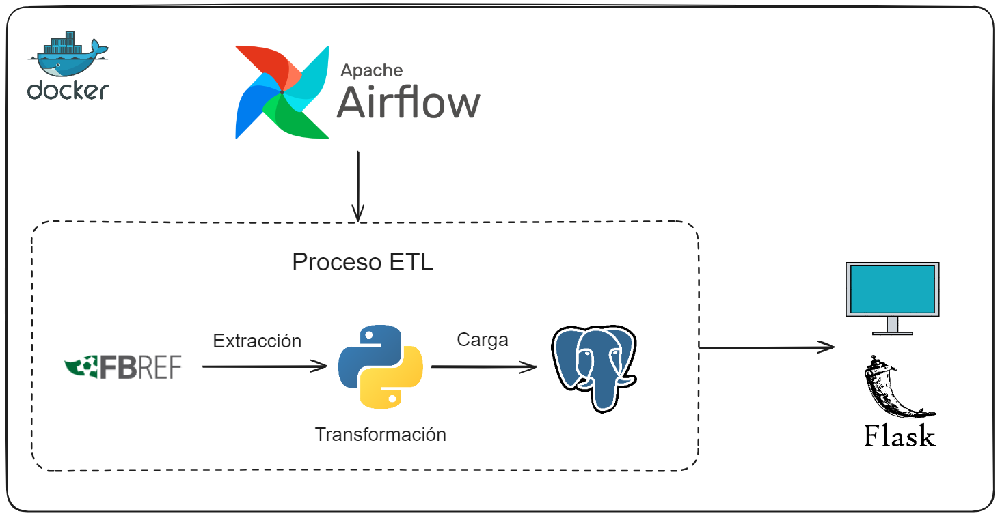

[](LICENSE)

# Partidos App

Bienvenido a mi aplicación de partidos, una plataforma interactiva diseñada para poder seguir en directo los partidos de futbol y sus resultados.

## Tabla de Contenidos
- [Funcionalidades Principales](#funcionalidades-principales)
- [Diagrama del proyecto](#diagrama-del-proyecto)
- [Instrucciones de Uso](#instrucciones-de-uso)
  - [Prerequisitos](#prerequisitos)
  - [Instalación](#instalación)
  - [Tests](#tests)
- [Tecnologías Utilizadas](#tecnologias-utilizadas)
- [Licencia](#licencia)
- [Contacto](#contacto)

## Funcionalidades Principales

- **Obtencion de los partidos:** Permite obtener los partidos de futbol de manera dinamica y actualizada con sus resultados.

- **Visualizar los partidos:** Permite navegar a traves de los dias para visualizar los diferentes partidos disputados.

## Diagrama del proyecto



## Instrucciones de Uso

### Prerequisitos

Antes de comenzar, asegúrate de tener instalado Docker en tu máquina. Puedes descargarlo [aquí](https://www.docker.com/get-started).

### Instalación

Para ejecutar la aplicación con Docker:

1. Clona este repositorio con el siguiente comando:

    ```bash
    git clone https://github.com/nachodorado98/Flask-Partidos
    ```

2. Navega al directorio del proyecto.

3. Ejecuta el siguiente comando para construir y levantar los contenedores:

    ```bash
    docker-compose up -d
    ```

4. Inicia el DAG en la interfaz de Apache Airflow para obtener y almacenar los partidos de manera actualizada: `http://localhost:8080`.

5. Accede a la aplicación desde tu navegador web: `http://localhost:5000`.

### Tests

Para ejecutar los tests de la aplicación:

1. Asegúrate de que los contenedores estén en funcionamiento. Si aún no has iniciado los contenedores, utiliza el siguiente comando:

    ```bash
    docker-compose up -d
    ```

2. Dentro del contenedor de la aplicacion, cambia al directorio de los tests:

    ```bash
    cd tests
    ```

3. Ejecuta el siguiente comando para ejecutar los tests utilizando pytest:

    ```bash
    pytest
    ```

Este comando ejecutará todas las pruebas en el directorio `tests` y mostrará los resultados en la consola.


## Tecnologías Utilizadas

- [](https://www.python.org/)
- [](https://airflow.apache.org/)
- [](https://flask.palletsprojects.com/)
- [](https://www.postgresql.org/)
- [](https://developer.mozilla.org/en-US/docs/Web/HTML)
- [](https://developer.mozilla.org/en-US/docs/Web/CSS)
- [](https://developer.mozilla.org/en-US/docs/Web/JavaScript)
- [](https://www.docker.com/)
## Licencia

Este proyecto está bajo la licencia MIT. Para mas informacion ver `LICENSE.txt`.
## 🔗 Contacto
[](https://github.com/nachodorado98/Flask-Partidos)

[](mailto:natxo98@gmail.com)

[](https://www.linkedin.com/in/nacho-dorado-ruiz-339209237/)
